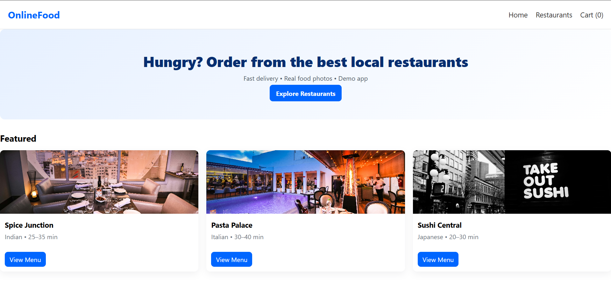
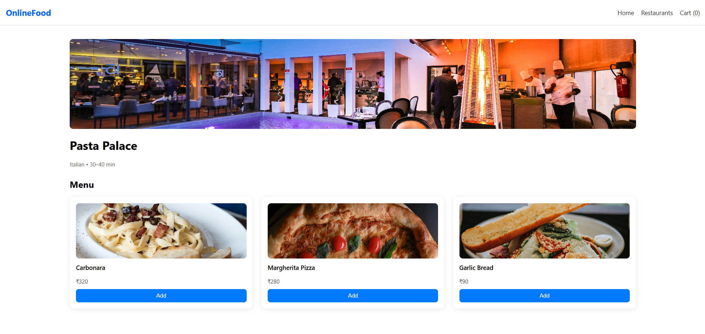
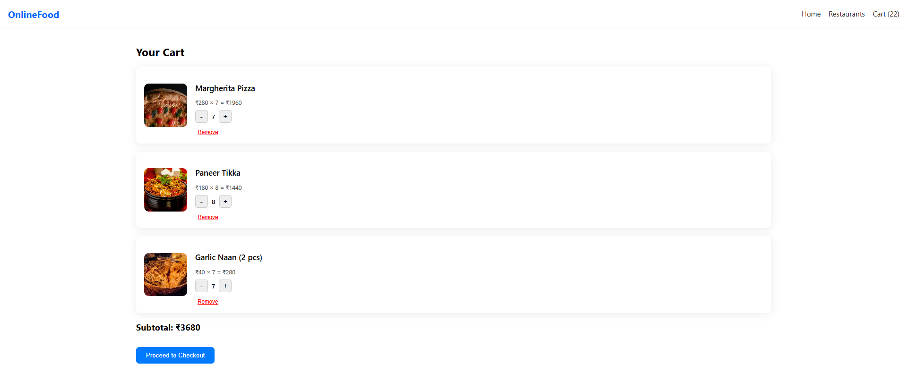
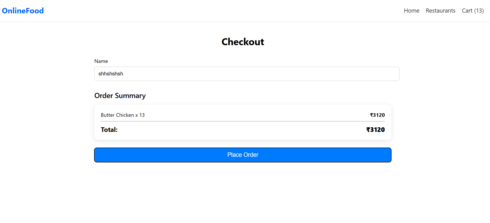
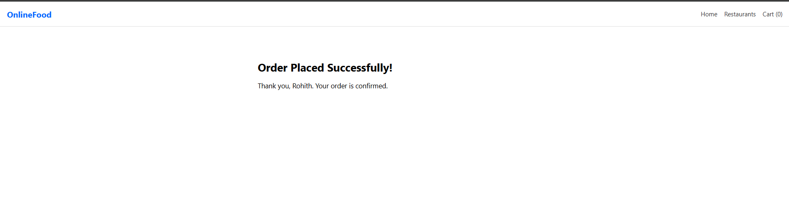

# 🛒 OnlineFood – React Food Ordering Application

**OnlineFood** is a fully responsive and modern food-ordering web application built using **React**.  
Users can browse restaurants, explore menus, update cart items in real time, and place orders seamlessly.

Live Demo:  
👉 **https://rohith-su.github.io/online-food-order/**

---

## 🚀 Features

### **1. Restaurant Browsing**
- View top restaurants with images, cuisine type, and delivery time.

### **2. Menu Display**
- Each restaurant displays a complete menu with images, prices, and Add-to-Cart options.

### **3. Shopping Cart (Live Update)**
- Add/remove items  
- Increase/decrease quantity  
- Auto-calculated subtotal and total  

### **4. Checkout Page**
- Enter user details  
- Displays full order summary  
- Final order total

### **5. Order Success Page**
- Displays confirmation message  
- Cart resets automatically after order

### **6. Responsive UI**
- Fully optimized for desktop and mobile  
- Clean, modern design

---

## 📸 Screenshots

### Home Page

### Restaurant Page

### Menu Page

### Cart Page

### Checkout Page

### Order Success Page

---

## 🛠️ Tech Stack

| Technology | Purpose |
|-----------|---------|
| **React.js** | UI Framework |
| **React Router** | Page routing |
| **Context API** | Global Cart State Management |
| **CSS / Flexbox / Responsive Layouts** | Styling |
| **GitHub Pages** | Deployment |

---

## 📂 Project Structure

online-food-order/
│
├── public/
│ ├── index.html
│ ├── screenshots/
│ │ ├── home-page.png
│ │ ├── restaurant-page.png
│ │ ├── menu-page.png
│ │ ├── cart-page.png
│ │ ├── checkout-page.png
│ │ └── order-success.png
│ └── images/ (restaurant & menu images)
│
├── src/
│ ├── components/
│ │ ├── Header.js
│ │ ├── RestaurantCard.js
│ │ └── MenuItemCard.js
│ │
│ ├── context/
│ │ └── CartContext.js
│ │
│ ├── pages/
│ │ ├── Home.js
│ │ ├── Restaurants.js
│ │ ├── Restaurant.js
│ │ ├── Cart.js
│ │ ├── Checkout.js
│ │ └── OrderSuccess.js
│ │
│ ├── App.js
│ ├── index.js
│ └── styles.css
│
├── package.json
├── package-lock.json
└── README.md

